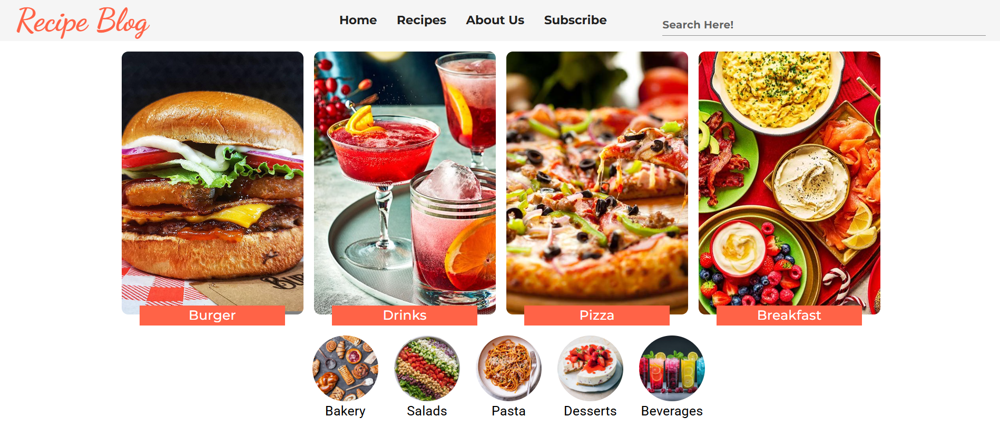
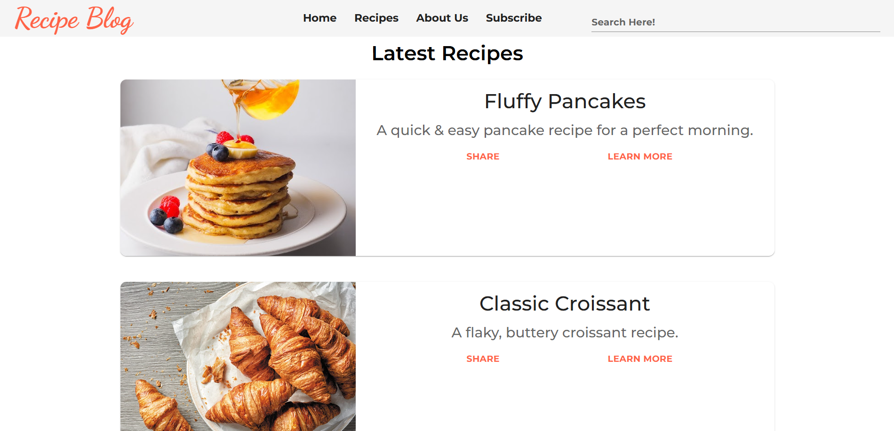
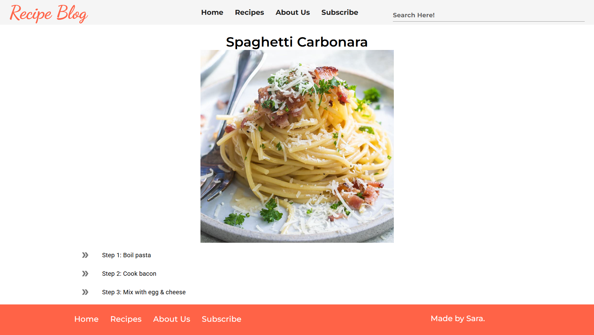
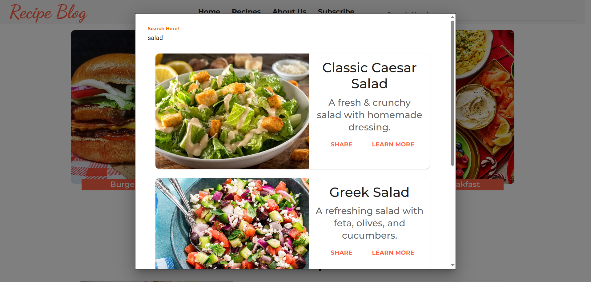

# 🍽️ Recipe Blog

A full-stack recipe blog application built with **React (frontend)**, **Django (backend)**, and **SQLite (database)**. Users can browse categories, view detailed recipes, and manage blog posts efficiently.

## 🚀 Features
- 🌟 Beautiful and responsive UI with **Material-UI**
- 📖 Categorized recipes (Bakery, Salads, Pasta, Desserts, Beverages)
- 🔍 Search functionality for recipes
- 🖼️ Images for blog posts
- 🔗 SEO-friendly URLs with **slugs**
- 📡 API integration using **Django REST Framework**

## 🎨 UI Preview

### 🏠 Home Page


### 📝 Recipe Catalogue


### 📖 Recipe Detail Page


### 🔍 Search Results


🌐 **Live Site:** [https://recipe-blog-react.vercel.app/](https://recipe-blog-react.vercel.app/) 

## 🏗️ Tech Stack
### **Frontend**
- React
- Material-UI
- Axios (for API calls)
- React Router

### **Backend**
- Django
- Django REST Framework
- SQLite

## 📦 Installation Guide

### **1️⃣ Clone the repository**
```bash
git clone https://github.com/saradotdev/Recipe-Blog.git
cd Recipe-Blog
```

### **2️⃣ Backend Setup (Django & SQLite)**
```bash
cd backend
python -m venv env
source env\Scripts\activate
pip install -r requirements.txt
```

**Set up database:**
```bash
python manage.py migrate
python manage.py createsuperuser  # Create an admin user
python manage.py runserver
```
Backend will be live at: **http://127.0.0.1:8000/**

### **3️⃣ Frontend Setup (React)**
```bash
cd frontend
npm install
npm start
```
Frontend will be live at: **http://localhost:3000/**

## 📜 API Endpoints
| Method | Endpoint | Description |
|--------|---------|-------------|
| GET | `/api/blogs/` | Fetch all blogs |
| GET | `/api/blogs/{slug}/` | Fetch a specific blog post |
| GET | `/api/category/` | Fetch all recipe categories |
| GET | `/api/category/{id}/` | Fetch a specific category |
| GET | `api/categoryBasedBlogs/{id}/` | Fetch all recipes in a specific category |

## 📧 Contact
If you have any questions or suggestions, feel free to reach out:
- **GitHub:** [@saradotdev](https://github.com/saradotdev)

📝 **Happy Coding & Cooking!** 🍕🔥
